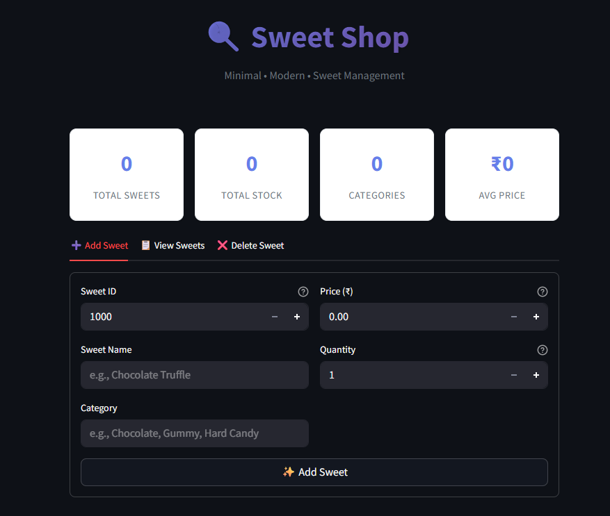
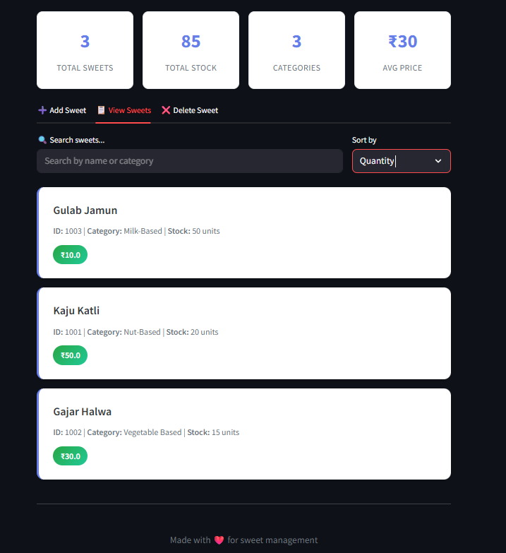
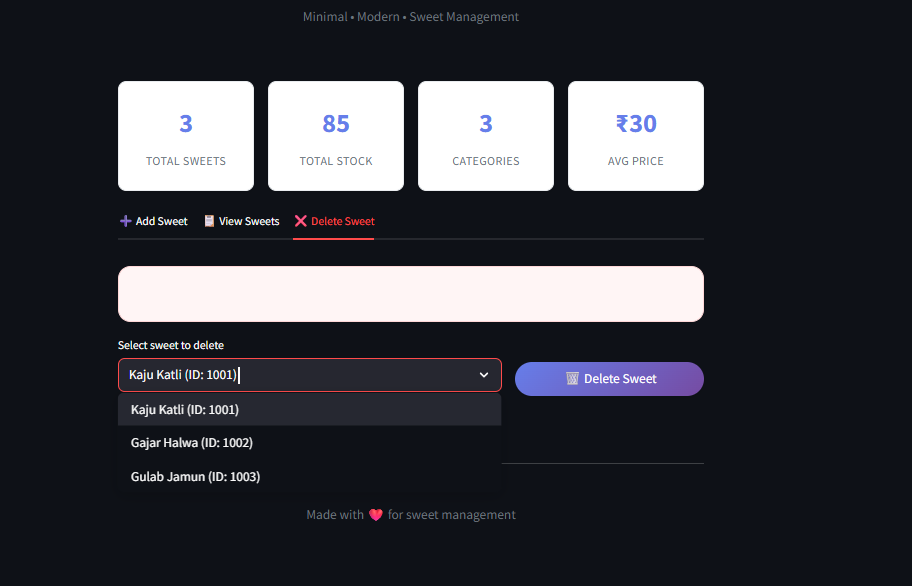

# 🍬 Sweet Shop Management System

A modern, minimal sweet shop inventory and management system built using **Python** and **Streamlit**, developed with a strict **Test-Driven Development (TDD)** approach.

---
## 🔁 Branches
Branch	Description
- main	Clean TDD-first solution ✅
- extended-tests-ai	AI-enhanced test coverage  🤖
  -- To check out the AI-enhanced version:
```
  git checkout ai-enhanced-version
```
### 🚦 Project Phases
## ✅ Phase 1: TDD-Driven Core
- Developed using the Red-Green-Refactor cycle
- Core features tested: add, delete, search, sort, purchase, restock
- Validations and error handling added based on observed behavior
- Streamlit UI built around the tested service layer

## 🤖 Phase 2: AI-Assisted Enhancements
To improve production-readiness and simulate real-world complexity:

- 🧠 Extended test suite to 45+ test cases
- 📌 Input validation for negative/zero values
- 🛠️ Error handling for invalid operations (e.g. duplicate ID, invalid restock/purchase)
- 🔄 More edge cases tested with pytest.raises
- 🧪 Better assertion coverage
- 📄 Branch: extended-tests-ai contains these changes

## ✨ Features

- 🧾 Add, delete, and view sweets
- 🔍 Search sweets by name, category, or price range
- 🔃 Sort sweets by name, category, price, or quantity (asc/desc)
- 🛒 Purchase sweets (decrease stock)
- 📦 Restock sweets (increase stock)
- ⚠️ Duplicate ID check & stock validation
- 📊 Real-time metrics: total stock, avg price, categories
- 🖥️ Streamlit web-based frontend
- ✅ Comprehensive test suite with `pytest`

---

## 🧠 Tech Stack

- **Language**: Python 3.10+
- **Testing**: `pytest`, `pytest-html`
- **UI**: Streamlit
- **Version Control**: Git (with meaningful commits)
- **Development Style**: Test-Driven Development (TDD)

---
```
sweet-shop-system/
│
│
├── models/ # Contains data models (Sweet class)
│ └── sweet.py
│
├── services/ # Business logic for managing sweets
│ └── sweet_service.py
│
├── tests/ # Pytest unit tests following TDD
│ └── test_sweet_service.py
│
├── main.py # Streamlit web UI to interact with the system
├── requirements.txt # Dependencies for running the project
├── README.md # You are here 😎
└── .gitignore # Ignore Python/cache/IDE files
```

---

## ⚙️ Setup Instructions

### ✅ 1. Clone the Repository

```
git clone https://github.com/Bhavik-Sanghar/sweet-shop-system.git
cd sweet-shop-system


python -m venv venv
source venv/bin/activate       # Mac/Linux
venv\Scripts\activate          # Windows


```
### ✅ 2.  Create a Virtual Environment (Optional but Recommended)
```bash
python -m venv venv
source venv/bin/activate       # Mac/Linux
venv\Scripts\activate          # Windows

pip install -r requirements.txt

```
🖥️ Running the Streamlit UI

```
streamlit run main.py
```

📊 Test Report
Test cases were written before implementation using TDD.
Here’s a preview of the report:
You can view the test report here:  
👉 [test_report.html](test_report.html)
[Report](Images/4.png)


🖼️ Frontend Screenshots





## 🤖 AI Usage
This project follows Incubyte's AI-first philosophy.
AI tools (like ChatGPT, Claude AI) were used in Phase 2 to enhance test coverage and simulate a more production-ready version.


🙌 Author & Notes
Made with 💻 and ☕ by Bhavik
This project was built for the Incubyte TDD assessment challenge.

Feel free to fork, explore, and improve.
